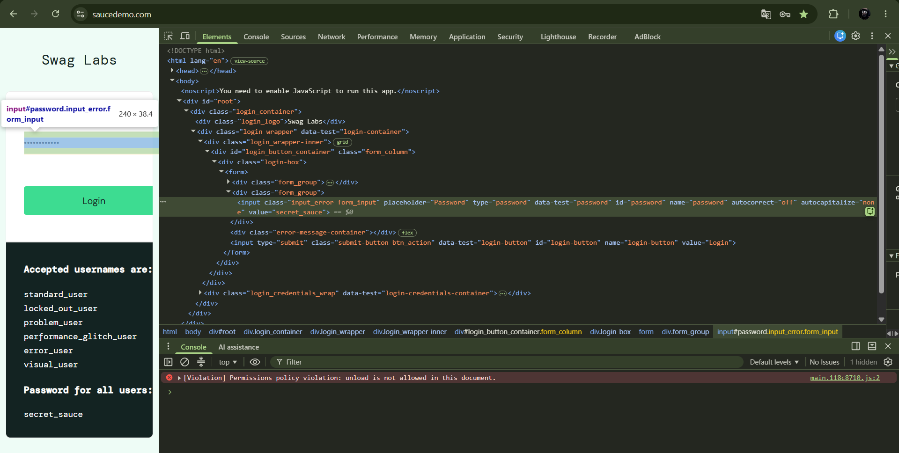
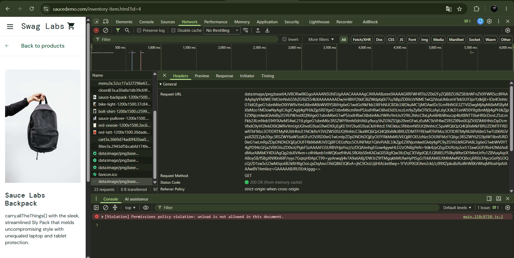
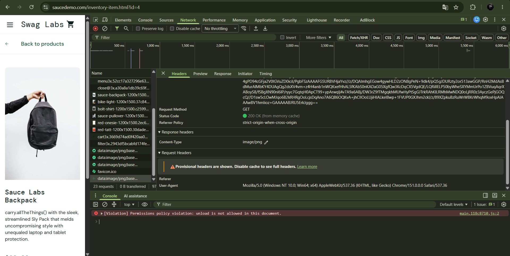
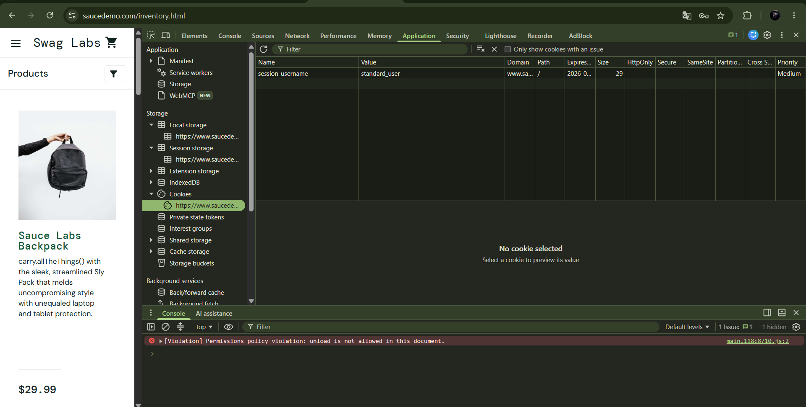
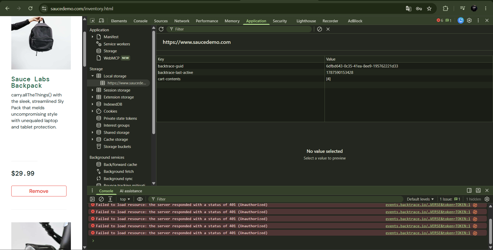

# Chrome DevTools Testing

Practical Chrome DevTools testing performed on the SauceDemo web application.

## Environment

- OS: Windows 11
- Browser: Google Chrome 151.0.7922.172 (Official Build) (64-bit)
- Application: SauceDemo

## Elements

The Password input element was inspected using the Elements panel.

The following attributes were identified:

- `id="password"`
- `name="password"`
- `type="password"`
- `placeholder="Password"`
- `class="input_error form_input"`

After entering the password, the input value was also visible in the DOM.

## Network

A resource request was inspected in the Network panel.

Observed data:

- Request Method: `GET`
- Status Code: `200 OK (from memory cache)`
- Content-Type: `image/png`
- User-Agent: Google Chrome on Windows

The inspected resource used a `data:image/png;base64,...` URL.

### Add to cart investigation

The Network panel was cleared and filtered by `Fetch/XHR` before clicking the `Add to cart` button.

No new Fetch/XHR request appeared after adding the product.

Further investigation in the Application panel showed that the cart state was changed in Local Storage.

## Cookies

After login, the following cookie was observed:

- `session-username = standard_user`

The cookie did not change after adding a product to the cart.

## Local Storage

Before adding a product:

`cart-contents = []`

After adding a product:

`cart-contents = [4]`

This suggests that the cart state is updated on the client side using Local Storage without sending a separate Fetch/XHR request at the moment the product is added.

## Conclusion

During this practice I used Chrome DevTools to inspect:

- DOM elements and HTML attributes
- HTTP resource requests
- Request and response information
- Cookies
- Local Storage
- Changes in application state after user actions
